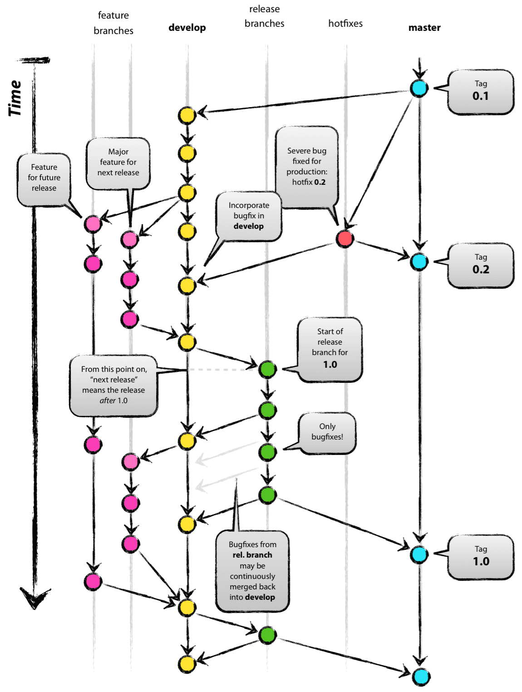

# GIT

## Estados

* Modificado (modified);
* Preparado (staged/index)
* Consolidado (comitted);

## Ajuda

##### Geral
	git help
	
##### Comando específico
	git help add
	git help commit
	git help <qualquer_comando_git>
	

## Configuração

### Geral

As configurações do GIT são armazenadas no arquivo **.gitconfig** localizado dentro do diretório do usuário do Sistema Operacional (Ex.: Windows: C:\Users\Documents and Settings\Leonardo ou *nix /home/leonardo).

As configurações realizadas através dos comandos abaixo serão incluídas no arquivo citado acima.

##### Setar usuário
	git config --global user.name "Cleiton Ferreira"

##### Setar email
	git config --global user.email cleitonferreiraa@hotmail.com
	
##### Setar editor
	git config --global core.editor vim
	
##### Setar ferramenta de merge
	git config --global merge.tool vimdiff

##### Setar arquivos a serem ignorados
	git config --global core.excludesfile ~/.gitignore

##### Listar configurações
	git config --list

### Ignorar Arquivos

Os nomes de arquivos/diretórios ou extensões de arquivos listados no arquivo **.gitignore** não serão adicionados em um repositório. Existem dois arquivos .gitignore, são eles:

* Geral: Normalmente armazenado no diretório do usuário do Sistema Operacional. O arquivo que possui a lista dos arquivos/diretórios a serem ignorados por **todos os repositórios** deverá ser declarado conforme citado acima. O arquivo não precisa ter o nome de **.gitignore**.

* Por repositório: Deve ser armazenado no diretório do repositório e deve conter a lista dos arquivos/diretórios que devem ser ignorados apenas para o repositório específico.

## Repositório Local

### Criar novo repositório

	git init

### Verificar estado dos arquivos/diretórios

	git status

### Adicionar arquivo/diretório (staged area)

##### Adicionar um arquivo em específico

	git add meu_arquivo.txt

##### Adicionar um diretório em específico

	git add meu_diretorio

##### Adicionar todos os arquivos/diretórios
	
	git add .	
	
##### Adicionar um arquivo que esta listado no .gitignore (geral ou do repositório)
	
	git add -f arquivo_no_gitignore.txt
	
### Comitar arquivo/diretório

##### Comitar um arquivo
	
	git commit meu_arquivo.txt

##### Comitar vários arquivos

	git commit meu_arquivo.txt meu_outro_arquivo.txt
	
##### Comitar informando mensagem

	git commit meuarquivo.txt -m "minha mensagem de commit"

### Remover arquivo/diretório

##### Remover arquivo

	git rm meu_arquivo.txt

##### Remover diretório

	git rm -r diretorio

### Visualizar histórico

##### Exibir histórico
	
	git log
	
##### Exibir histórico com diff das duas últimas alterações

	git log -p -2
	
##### Exibir resumo do histórico (hash completa, autor, data, comentário e qtde de alterações (+/-))

	git log --stat
	
##### Exibir informações resumidas em uma linha (hash completa e comentário)

	git log --pretty=oneline
	
##### Exibir histórico com formatação específica (hash abreviada, autor, data e comentário)

	git log --pretty=format:"%h - %an, %ar : %s"
	
* %h: Abreviação do hash;
* %an: Nome do autor;
* %ar: Data;
* %s: Comentário.

Verifique as demais opções de formatação no [Git Book](http://git-scm.com/book/en/Git-Basics-Viewing-the-Commit-History)

##### Exibir histório de um arquivo específico

	git log -- <caminho_do_arquivo>

##### Exibir histórico de um arquivo específico que contêm uma determinada palavra

	git log --summary -S<palavra> [<caminho_do_arquivo>]

##### Exibir histórico modificação de um arquivo

	git log --diff-filter=M -- <caminho_do_arquivo>

* O <D> pode ser substituido por: Adicionado (A), Copiado (C), Apagado (D), Modificado (M), Renomeado (R), entre outros.

##### Exibir histório de um determinado autor

	git log --author=usuario

##### Exibir revisão e autor da última modificação de uma bloco de linhas

	git blame -L 12,22 meu_arquivo.txt 

### Desfazendo operações

##### Desfazendo alteração local (working directory)
Este comando deve ser utilizando enquanto o arquivo não foi adicionado na **staged area**. 

	git checkout -- meu_arquivo.txt

##### Desfazendo alteração local (staging area)
Este comando deve ser utilizando quando o arquivo já foi adicionado na **staged area**.

	git reset HEAD meu_arquivo.txt

Se o resultado abaixo for exibido, o comando reset *não* alterou o diretório de trabalho. 

	Unstaged changes after reset:
	M	meu_arquivo.txt

A alteração do diretório pode ser realizada através do comando abaixo:
	
	git checkout meu_arquivo.txt

## Repositório Remoto

### Exibir os repositórios remotos

	git remote
	
	git remote -v

### Vincular repositório local com um repositório remoto

	git remote add origin git@github.com:leocomelli/curso-git.git
	
### Exibir informações dos repositórios remotos

	git remote show origin
	
### Renomear um repositório remoto 

	git remote rename origin curso-git
	
### Desvincular um repositório remoto
	
	git remote rm curso-git

### Enviar arquivos/diretórios para o repositório remoto

O primeiro **push** de um repositório deve conter o nome do repositório remoto e o branch.

	git push -u origin master
	
Os demais **pushes** não precisam dessa informação

	git push
	

### Atualizar repositório local de acordo com o repositório remoto

##### Atualizar os arquivos no branch atual

	git pull
	
##### Buscar as alterações, mas não aplica-las no branch atual

	git fetch
	
### Clonar um repositório remoto já existente

	git clone git@github.com:leocomelli/curso-git.git
	
### Clonar branch github

	git clone -b <branch> <remote_repo>
	git clone -b develop git@github.com:user/myproject.git
	
### Tags

##### Criando uma tag leve

	git tag vs-1.1

##### Criando uma tag anotada

	git tag -a vs-1.1 -m "Minha versão 1.1"

##### Criando uma tag assinada
Para criar uma tag assinada é necessário uma chave privada (GNU Privacy Guard - GPG).

	git tag -s vs-1.1 -m "Minha tag assinada 1.1"

##### Criando tag a partir de um commit (hash)

	git tag -a vs-1.2 9fceb02
	
##### Criando tags no repositório remoto

	git push origin vs-1.2
	
##### Criando todas as tags locais no repositório remoto

	git push origin --tags
	
### Branches

O **master** é o branch principal do GIT.

O **HEAD** é um ponteiro *especial* que indica qual é o branch atual. Por padrão, o **HEAD** aponta para o branch principal, o **master**.

##### Criando um novo branch

	git branch bug-123
	
##### Trocando para um branch existente

	git checkout bug-123
	
Neste caso, o ponteiro principal **HEAD** esta apontando para o branch chamado bug-123.

##### Criar um novo branch e trocar 

	git checkout -b bug-456
	
##### Voltar para o branch principal (master)

	git checkout master
	
##### Resolver merge entre os branches

	git merge bug-123
	
Para realizar o *merge*, é necessário estar no branch que deverá receber as alterações. O *merge* pode automático ou manual. O merge automático será feito em arquivos textos que não sofreram alterações nas mesmas linhas, já o merge manual será feito em arquivos textos que sofreram alterações nas mesmas linhas.

A mensagem indicando um *merge* manual será:

	Automerging meu_arquivo.txt
	CONFLICT (content): Merge conflict in meu_arquivo.txt
	Automatic merge failed; fix conflicts and then commit the result.

##### Apagando um branch

	git branch -d bug-123

##### Listar branches 

###### Listar branches

	git branch

###### Listar branches com informações dos últimos commits

	git branch -v

###### Listar branches que já foram fundidos (merged) com o **master**

	git branch --merged

###### Listar branches que não foram fundidos (merged) com o **master**

	git branch --no-merged

##### Criando branches no repositório remoto

###### Criando um branch remoto com o mesmo nome

	git push origin bug-123

###### Criando um branch remoto com nome diferente

	git push origin bug-123:new-branch

##### Baixar um branch remoto para edição

	git checkout -b bug-123 origin/bug-123

##### Apagar branch remoto

	git push origin:bug-123

### Rebasing

Fazendo o **rebase** entre um o branch bug-123 e o master.

	git checkout experiment
	
	git rebase master
	

Mais informações e explicações sobre o [Rebasing](http://git-scm.com/book/en/Git-Branching-Rebasing)

###Stash

Para alternar entre um branch e outro é necessário fazer o commit das alterações atuais para depois trocar para um outro branch. Se existir a necessidade de realizar a troca sem fazer o commit é possível criar um **stash**. O Stash como se fosse um branch temporário que contem apenas as alterações ainda não commitadas.

##### Criar um stash
	
	git stash
	
##### Listar stashes

	git stash list

##### Voltar para o último stash

	git stash apply

##### Voltar para um stash específico
	
	git stash apply stash@{2}
	
Onde **2** é o indíce do stash desejado.

##### Criar um branch a partir de um stash

	git stash branch meu_branch

### Reescrevendo o histórico

##### Alterando mensagens de commit

	git commit --amend -m "Minha nova mensagem"

##### Alterar últimos commits
Alterando os três últimos commits

	git rebase -i HEAD~3

O editor de texto será aberto com as linhas representando os três últimos commits.

	pick f7f3f6d changed my name a bit
	pick 310154e updated README formatting and added blame
	pick a5f4a0d added catfile

Altere para edit os commits que deseja realizar alterações.

	edit f7f3f6d changed my name a bit
	pick 310154e updated README formatting and added blame
	pick a5f4a0d added catfile

Feche o editor de texto.

Digite o comando para alterar a mensagem do commit que foi marcado como *edit*.

	git commit –amend -m “Nova mensagem”

Aplique a alteração

	git rebase --continue

**Atenção:** É possível alterar a ordem dos commits ou remover um commit apenas
mudando as linhas ou removendo.

##### Juntando vários commits
Seguir os mesmos passos acima, porém marcar os commtis que devem ser juntados com **squash*
	
##### Remover todo histórico de um arquivo

	git filter-branch --tree-filter 'rm -f passwords.txt' HEAD
	
	
### Bisect
O bisect (pesquisa binária) é útil para encontrar um commit que esta gerando um bug ou uma inconsistência entre uma sequência de commits.

##### Iniciar pequinsa binária

	git bisect start
	
##### Marcar o commit atual como ruim

	git bisect bad

##### Marcar o commit de uma tag que esta sem o bug/inconsistência

	git bisect good vs-1.1

##### Marcar o commit como bom
O GIT irá navegar entre os commits para ajudar a indentificar o commit que esta com o problema. Se o commit atual não estiver quebrado, então é necessário marca-lo como **bom**.

	git bisect good

##### Marcar o commit como ruim
Se o commit estiver com o problema, então ele deverá ser marcado como **ruim**.

 	git bisect bad
 
##### Finalizar a pesquisa binária
Depois de encontrar o commit com problema, para retornar para o *HEAD* utilize:
	
	git bisect reset
	
##### Tenho que voltar para uma versão antiga, e agora ?	
	git reset --hard {hash-do-commit-desejado}

##### Deletar a branch feature local	
	git branch -D feature/{branch}
	
##### Deletar a branch feature remota	
	git push origin :feature/{branch}
	
##### Nome de arquivo muito longo no Git para Windows	
	git clone -c core.longpaths=true <repo-url>	

## Utilizando o fluxo Git Flow

### Git Flow

Se você já trabalha com o git como principal ferramenta de controle de versão, já deve ter visto várias abordagens de como utilizar e controlar branchs em um cenário de produção ou pessoal.

E se você é novo com git, este fluxo irá te ajudar a ter maior familiaridade de como empresas, projetos opensource costumam utilizar seus fluxos de trabalho.

É muito comum vermos pessoas utilizando somente um branch para fazer commits em projetos pessoais. Isto não é errado, é muito tranquilo de se controlar tudo em uma branch quando se está desenvolvendo sozinho, mas o cenário muda bastante quando temos que interagir com mais contribuidores, seja em um projeto opensource ou privado.

Nessas horas é suma importância que se tenha total controle do que está sendo produzido por sua equipe, onde, ao mesmo tempo são corrigidos falhas, implementado novas funcionalidades e ter o seu código de produção com total funcionamento entregue ao seu cliente.

É ai que o fluxo de git flow nos ajuda, vem com o cabrito olhar a imagem abaixo para entender melhor:

A **master** irá contér todo código já testado, versionado que será entregue ao cliente e a **develop** é onde todo fluxo de trabalho irá ocorrer antes de fazer o release versionado que será feito merge na **master**.

A **develop** deve sempre conter o código mais atual, onde as branchs de features serão ramificadas tendo ela como base.
Exemplo, suponhamos que você precise criar um feature que mudará todo o fluxo e interface de um componente, como fariamos para criar nossa branch ?
	
#### Certifique-se de que a branch develop existe no seu repositório remoto listando suas branchs locais e remotas:
	git branch -a
	
#### Caso não esteja, faça a sincronização do seu repositório remoto, faça o checkout criando sua branch develop e envie para seu repositório remoto:
	git fetch origin && git checkout -b develop && git push origin develop	
	

Após ter criado a develop, onde irá acontecer todo desenvolvimento, crie a branch respectiva a sua implementação, lembre-se de manter um padrão de nomenclatura para facilitar o entendimento como é sugerido no git flow:	

**feature:** para novas implementações
**release:** para finalizar o release e tags
**hotfix:** para resolver problema crítico em produção que não pode esperar novo release

#### Neste caso, como já estamos na develop:
	git checkout -b feature/novo-componente
	

#### Após criado, você trabalha em sua modificação localmente, caso seja necessário que outra pessoa trabalhe nesta mesma implementação você deve compartilhar para seu repositório remoto:
	git push origin feature/novo-componente	

#### Show, implementação feita, agora é hora de fazer o merge deste feature com a develop, para isto, faça o checkout para a branch develop, faça o merge da feature e atualize o remoto:
	git checkout develop && git merge feature/novo-componente && git push origin develop
	
#### Trazer as alterações da develop para a minha branch, faça o checkout para a branch feature, faça o merge da develop e atualize o remoto:
	git checkout feature/novo-componente && git merge develop && git push origin feature/novo-componente	

#### Caso não ocorra nenhum conflito, beleza, estamos prontos para fazer o release desta implementação e submeter ao repositório remoto, para isto, crie a branch de release e envie:
	git checkout -b release/v1.0.1 && git push origin release/v1.0.1	
	

#### Após feito os ultimos testes, você já pode fazer a tag da versão:
	git tag -a v1.0.1 -m "Release do novo componente"

Lembrando, que se foi identificado algum bug durante o processo, você deve tratar este bug na branch de release, enviar para a master e para a develop também, fazendo que a develop sempre contenha as correções.

#### Nas hora de inserir a tag, gosto de utilizar tag anotadas, pois ela registra informações de quem fez a tag, data, hash, caso não queira estas informações, simplifique:	
	git tag v1.0.1

#### Agora vamos conferir se a tag foi criada e enviar para o repositório remoto:
	git show v1.0.1 && git push origin v1.0.1	

#### Se tudo correu bem, sua tag será criada e estamos aptos a fazer o merge com a master deste pequeno release na master:
	git checkout master && git merge release/v1.0.1	

	
Prontinho, desta forma, obtemos informações de todas as etapas do desenvolvimento, além de padronizar a nomenclatura das branchs facilitando na hora de puxar um log maroto.
	
Resumindo, aprendemos como controlar nossas branch separadas por suas responsabilidades, não impactando na master que é onde nosso código estável se mantém fiel, utilizamos tags para versionar nossas releases e ter um controle bem mais flexível.	
	
# Contribuições

Sinta-se a vontade para realizar adicionar mais informações ou realizar correções. Fork me!

